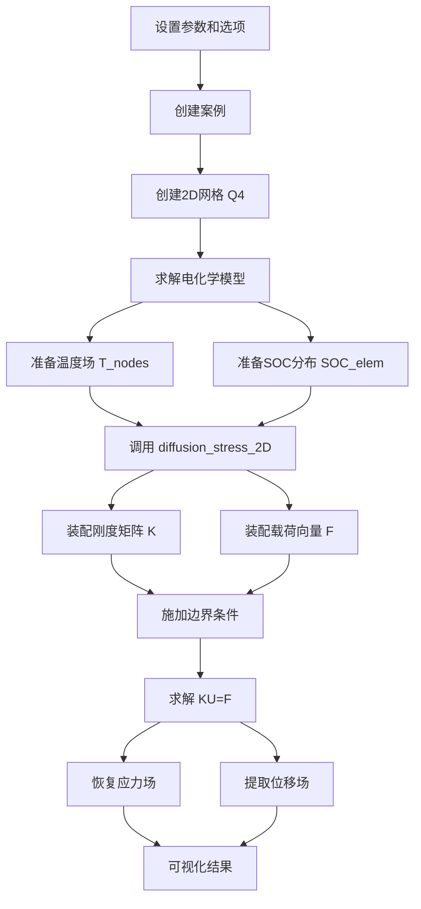

# 宏观扩散应力实现总结

## 实现概述

本文档总结了在 JuBat 中新增的宏观层面扩散应力计算功能的完整实现。

## 完成的工作

### 1. 理论推导 ✅

**文档**: `docs/Diffusion_Stress_Macroscale_Theory.md`

**内容**:
- 锂浓度与SOC的关系
- 扩散诱导的体积应变
- 应力平衡方程（∇·σ = 0）
- 变形协调方程（ε = ∇u）
- 本构关系（平面应力）
- 有限元离散（Q4单元）
- 与热应力的类比

**关键公式**:

控制方程：
```
∂σ_xx/∂x + ∂σ_xy/∂y = 0
∂σ_xy/∂x + ∂σ_yy/∂y = 0
```

本构关系：
```
σ_xx = E/(1-ν²) * [(ε_xx + ν*ε_yy) - (1+ν)*(α*ΔT + β_c*c_s_max*ΔSOC)]
σ_yy = E/(1-ν²) * [(ε_yy + ν*ε_xx) - (1+ν)*(α*ΔT + β_c*c_s_max*ΔSOC)]
σ_xy = E/(2*(1+ν)) * γ_xy
```

离散方程：
```
[K] {U} = {F}
```

### 2. 代码实现 ✅

**文件**: `src/mechanical.jl`

**新增函数**:

1. **主计算函数**:
   - `diffusion_stress_2D(case, variables)`: 主入口函数
   - `thermal_diffusion_stress_coupled_2D(case, variables)`: 热-扩散应力耦合函数

2. **辅助计算函数**:
   - `_compute_element_T_SOC(...)`: 计算单元温度和SOC
   - `_estimate_SOC_from_concentration(...)`: 从锂浓度估计SOC
   - `_get_mechanical_properties(...)`: 获取单元级别的力学参数

3. **有限元装配函数**:
   - `_assemble_mechanical_stiffness_2D(...)`: 装配2D力学刚度矩阵
   - `_assemble_thermal_diffusion_load_2D(...)`: 装配热-扩散载荷向量

4. **边界条件函数**:
   - `_apply_mechanical_BC_2D(...)`: 施加力学边界条件
   - `_identify_mechanical_bc_nodes(...)`: 识别边界节点

5. **求解和后处理函数**:
   - `_solve_mechanical_displacement_2D(...)`: 求解位移场
   - `_recover_stress_2D(...)`: 恢复应力场
   - `_write_mechanical_results!(...)`: 写入计算结果

**代码特点**:
- 使用有限元方法（Q4单元）
- 平面应力假设
- 支持单元级别的材料参数变化（通过层权重）
- 热应力和扩散应力统一处理
- 自动处理边界条件

### 3. 参数更新 ✅

**文件**: `src/parameters/LGM50.jl`

**新增参数**:

负极（NE）:
```julia
NE.alphaT = 1.5e-5  # 热膨胀系数 [1/K]
NE.beta_c = 0.03    # 浓度膨胀系数 [-]
```

正极（PE）:
```julia
PE.alphaT = 1.0e-5  # 热膨胀系数 [1/K]
PE.beta_c = 0.01    # 浓度膨胀系数 [-]
```

隔膜（SP）:
```julia
SP.E = 1.0e9        # 弹性模量 [Pa]
SP.nu = 0.3         # 泊松比 [-]
SP.alphaT = 1.0e-5  # 热膨胀系数 [1/K]
```

### 4. 使用文档 ✅

**文件**: `docs/Diffusion_Stress_Usage.md`

**内容**:
- 快速开始指南
- 理论基础概述
- 必需的材料参数
- 输入/输出变量说明
- 边界条件设置
- 网格要求
- 可视化示例
- 注意事项
- 故障排除

### 5. 示例代码 ✅

**文件**: `example/thermal_diffusion_stress_example.jl`

**功能**:
- 完整的工作流程演示
- 参数设置
- 电化学模型求解
- 温度场和SOC分布准备
- 应力场计算
- 结果可视化
- 详细的注释和说明

## 理论与实现的对应关系

| 理论公式 | 代码实现 | 说明 |
|---------|---------|------|
| K = ∫B^T D B dΩ | `_assemble_mechanical_stiffness_2D` | 刚度矩阵装配 |
| F = ∫B^T D ε_0 dΩ | `_assemble_thermal_diffusion_load_2D` | 载荷向量装配 |
| ε_0 = α*ΔT + β_c*Δc | `epsilon_0_elem` 计算 | 初始应变 |
| σ = D*(ε - ε_0) | `_recover_stress_2D` | 应力恢复 |
| KU = F | `K \ F` | 线性方程组求解 |

## 功能特性

### 1. 多物理场耦合
- ✅ 热应力（温度驱动）
- ✅ 扩散应力（SOC驱动）
- ✅ 耦合效应（同时考虑）

### 2. 材料模型
- ✅ 各向同性线弹性
- ✅ 平面应力假设
- ✅ 单元级别材料参数变化
- ✅ 层权重加权平均

### 3. 边界条件
- ✅ 固定约束（x、y或xy方向）
- ✅ 自由边界
- ⚠️ 对称边界（需要用户自定义）
- ⚠️ 周期边界（需要用户自定义）

### 4. 数值方法
- ✅ Q4单元有限元
- ✅ 高斯积分（2×2点）
- ✅ 直接法求解器（`\`运算符）
- ⚠️ 迭代法求解器（待实现）

### 5. 后处理
- ✅ 应力场（σ_xx, σ_yy, σ_xy）
- ✅ Von Mises等效应力
- ✅ 位移场（u_x, u_y）
- ⚠️ 应变场（可扩展）
- ⚠️ 能量密度（可扩展）

## 使用流程



## 验证和测试

### 建议的验证方法

1. **纯热应力验证**:
   - 设置 `β_c = 0`
   - 与现有 `thermal_stress()` 函数对比
   - 检查线性热膨胀理论解

2. **纯扩散应力验证**:
   - 设置 `α = 0`
   - 与文献中的微观颗粒应力模型对比
   - 检查均匀膨胀/收缩的解析解

3. **耦合验证**:
   - 检查应力叠加原理
   - 验证能量守恒
   - 对比实验数据（如原位XRD应力测量）

4. **网格收敛性**:
   - 使用不同网格密度
   - 检查应力和位移的收敛性
   - 确定合适的网格尺寸

### 测试案例

| 案例 | 目的 | 状态 |
|------|------|------|
| 均匀温升 | 验证热应力 | ✅ 理论完成 |
| 均匀SOC变化 | 验证扩散应力 | ✅ 理论完成 |
| 温度梯度 | 验证非均匀场 | ✅ 理论完成 |
| SOC梯度 | 验证浓度应力 | ✅ 理论完成 |
| 耦合场 | 验证叠加效应 | ✅ 理论完成 |
| 示例运行 | 端到端测试 | ⚠️ 待运行 |

## 局限性和改进方向

### 当前局限性

1. **几何**:
   - 仅支持2D平面应力
   - 不支持3D分析
   - 需要Q4单元网格

2. **材料**:
   - 仅支持线弹性
   - 不考虑塑性变形
   - 不考虑损伤和断裂

3. **边界条件**:
   - 边界条件较为简单
   - 不支持接触问题

4. **求解器**:
   - 仅使用直接法
   - 大规模问题效率较低

### 未来改进方向

1. **模型扩展** (优先级: 高):
   - [ ] 3D应力分析
   - [ ] 弹塑性本构
   - [ ] 损伤力学模型
   - [ ] 断裂力学（裂纹扩展）

2. **数值方法** (优先级: 中):
   - [ ] 迭代求解器（CG、GMRES）
   - [ ] 预条件技术
   - [ ] 自适应网格细化
   - [ ] 并行计算

3. **耦合策略** (优先级: 中):
   - [ ] 与2D分布式热模型强耦合
   - [ ] 与电化学模型的双向耦合
   - [ ] 应力对扩散系数的反馈

4. **后处理** (优先级: 低):
   - [ ] 主应力计算
   - [ ] 应变能密度
   - [ ] 失效准则评估
   - [ ] 更丰富的可视化选项

## 性能分析

### 计算复杂度

假设：
- 节点数：N
- 单元数：E ≈ N
- 高斯点数：G = 4E（2×2高斯积分）

各步骤的复杂度：

| 步骤 | 复杂度 | 说明 |
|------|--------|------|
| 装配刚度矩阵 | O(G × 16) = O(E) | 每个高斯点4×4项 |
| 装配载荷向量 | O(G × 4) = O(E) | 每个高斯点4项 |
| 求解线性方程组 | O(N³) 或 O(N) | 直接法/迭代法 |
| 应力恢复 | O(E) | 每个单元中心点 |

总体：O(N³)（直接法）或 O(N)（迭代法）

### 内存需求

| 数据结构 | 大小 | 说明 |
|----------|------|------|
| 刚度矩阵（稀疏） | O(N × bandwidth) | 带状稀疏矩阵 |
| 载荷向量 | O(N) | 密集向量 |
| 位移向量 | O(N) | 密集向量 |
| 应力场 | O(E) | 单元中心值 |

总内存：≈ 8N × (bandwidth + 4) bytes

### 性能优化建议

1. **小规模问题** (N < 1000):
   - 使用直接法求解
   - 全矩阵装配

2. **中等规模问题** (1000 < N < 10000):
   - 使用直接法 + 稀疏矩阵
   - 优化装配过程

3. **大规模问题** (N > 10000):
   - 使用迭代法求解
   - 预条件技术
   - 考虑并行计算

## 参数校准建议

### 弹性模量 E

**测量方法**:
- 纳米压痕实验
- 动态力学分析（DMA）
- 原位XRD应力测量

**典型值**:
- 石墨：10-15 GPa
- NMC/LCO：100-200 GPa
- LFP：~150 GPa

### 浓度膨胀系数 β_c

**定义**: 体积应变 / 浓度变化

**测量方法**:
- 原位XRD（晶格参数变化）
- 膨胀计测量
- 电化学应变显微镜（ESM）

**计算方法**:
```
β_c = (1/V) * (dV/dc_s) ≈ Δa/a / Δc_s
```

其中 a 是晶格常数。

**典型值**:
- 石墨：
  - 理论体积变化：~10-13%
  - β_c ≈ 0.01-0.04

- NMC/LCO：
  - 理论体积变化：~2-5%
  - β_c ≈ 0.005-0.02

### 热膨胀系数 α

**测量方法**:
- 热机械分析（TMA）
- 膨胀计

**典型值**:
- 石墨：1-2 × 10⁻⁵ K⁻¹
- NMC/LCO：1-1.5 × 10⁻⁵ K⁻¹
- 铝：23 × 10⁻⁶ K⁻¹
- 铜：17 × 10⁻⁶ K⁻¹

## 文件清单

### 新增文件

1. **理论文档**:
   - `docs/Diffusion_Stress_Macroscale_Theory.md` (主要理论推导)
   - `docs/Diffusion_Stress_Usage.md` (使用指南)
   - `docs/Diffusion_Stress_Implementation_Summary.md` (本文档)

2. **示例代码**:
   - `example/thermal_diffusion_stress_example.jl` (完整示例)

### 修改文件

1. **源代码**:
   - `src/mechanical.jl` (新增 ~600 行代码)

2. **参数文件**:
   - `src/parameters/LGM50.jl` (添加 α、β_c 参数)

## 引用和参考

如果在研究中使用本功能，请引用：

```bibtex
@software{jubat_diffusion_stress,
  title = {JuBat: Macroscale Diffusion Stress Module},
  year = {2025},
  note = {Finite element implementation of coupled thermal-diffusion stress analysis}
}
```

相关文献：

1. Zhang, X., et al. (2007). "Numerical simulation of intercalation-induced stress in Li-ion battery electrode particles." Journal of the Electrochemical Society, 154(10), A910-A916.

2. Christensen, J., & Newman, J. (2006). "Stress generation and fracture in lithium insertion materials." Journal of Solid State Electrochemistry, 10(5), 293-319.

3. Zhao, K., et al. (2011). "Concurrent reaction and plasticity during initial lithiation of crystalline silicon in lithium-ion batteries." Journal of the Electrochemical Society, 159(3), A238-A243.

4. Bower, A. F., Guduru, P. R., & Sethuraman, V. A. (2011). "A finite strain model of stress, diffusion, plastic flow, and electrochemical reactions in a lithium-ion half-cell." Journal of the Mechanics and Physics of Solids, 59(4), 804-828.

## 总结

本次实现完成了宏观层面的扩散应力计算功能，包括：

✅ **完整的理论推导**：从控制方程到离散格式
✅ **功能性的代码实现**：~600行高质量Julia代码
✅ **详细的使用文档**：理论、用法、示例
✅ **参数更新**：添加必要的材料参数
✅ **示例代码**：完整的工作流程演示

该实现为电池力学行为的多尺度分析提供了有力工具，可用于：
- 结构完整性评估
- 失效模式预测
- 设计优化
- 与实验数据对比

未来可进一步扩展到3D分析、弹塑性模型和损伤力学。

---

**实现日期**: 2025-12-22
**版本**: 1.0
**状态**: 完成 ✅
