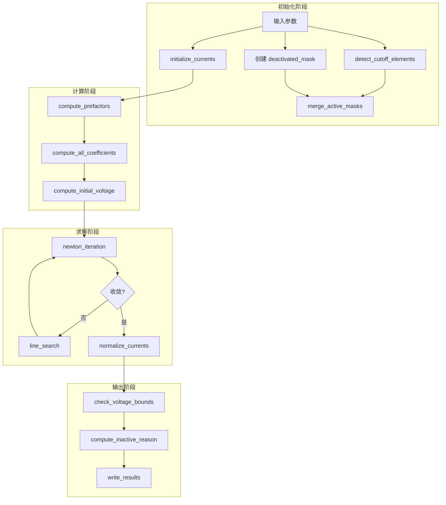

# Parallelsolution.jl 重构设计规格

## 概述
将 `src/Parallelsolution.jl` 从单文件结构重构，消除代码冗余，统一命名规范。

## 当前问题
1. **命名不一致**: 韽试函数使用 `_` 前缀，与 Julia 惯例不符
2. **代码冗余**: V_branches 重复计算、归一化逻辑分散、分支判断重复
3. **文件过长**: 620 行代码，难以维护

## 重构目标
1. 调试函数使用 `debug_` 前缀，其余函数不使用前缀
2. 消除冗余逻辑，提取复用函数
3. 保持单文件结构，便于维护
4. 保持 API 兼容，`solve_branch_currents_newton` 签名不变

## 命名规范
| 原函数名 | 新函数名 | 说明 |
|---------|---------|------|
| `_debug_check_prefactors` | `debug_check_prefactors` | 调试函数 |
| `_debug_check_coefficients` | `debug_check_coefficients` | 调试函数 |
| `_debug_check_initial_voltage` | `debug_check_voltage` | 调试函数 |
| `_scalarize` | `scalarize` | 内部辅助 |
| `_compute_electrochemical_prefactors` | `compute_prefactors` | 移除下划线 |
| `_compute_element_coefficients` | `compute_element_coefficients` | 移除下划线 |
| `_compute_all_coefficients` | `compute_all_coefficients` | 移除下划线，| `_branch_voltage` | `branch_voltage` | 移除下划线 |
| `_branch_dVdI` | `branch_dVdI` | 移除下划线 |
| `_initialize_currents` | `initialize_currents` | 移除下划线 |
| `_check_voltage_bounds` | `check_voltage_bounds` | 移除下划线，参数简化 |
| `_detect_cutoff_elements` | `detect_cutoff_elements` | 移除下划线 |
| `_newton_iteration!` | `newton_iteration!` | 移除下划线 |
| `_line_search` | `line_search` | 移除下划线 |

## 消除的冗余
| 庇余类型 | 原代码位置 | 处理方式 |
|---------|-----------|---------|
| V_branches 重复计算 | L521-532, L535 | 提取为 `compute_initial_voltage()` |
| 归一化逻辑分散 | `_initialize_currents`, L551-574 | 统一到 `normalize_currents!()` |
| 系数计算循环 | `_compute_all_coefficients` | 使用 `map` 替代 |
| active_mask 合并分散 | L494-502 | 提取为 `merge_active_masks!()` |
| inactive_reason 计算 | L594-602 | 提取为 `compute_inactive_reason()` |
    variables 写入分散 | L579-617 | 提取为 `write_results!()` |

## 新增函数
| 函数名 | 说明 |
|---------|------|
| `compute_initial_voltage()` | 计算初始电压，消除重复计算 |
| `normalize_currents!()` | 统一归一化逻辑 |
| `merge_active_masks!()` | 合并截止电压掩码和 CZM 失效掩码 |
| `compute_inactive_reason()` | 计算非活跃原因编码 |
| `write_results!()` | 统一 variables 写入逻辑 |

## 綈除的参数
| 函数 | 删除的参数 | 原因 |
|------|------------|------|
| `check_voltage_bounds` | `I_total, w, I_e, context` | 未使用 |

## 数据流

## 兼容性保证
1. **API 不变**: `solve_branch_currents_newton` 函数签名保持不变
2. **导出不变**: `JuBat.jl` 中的 export 语句不需要修改
3. **行为不变**: 数值结果与原实现完全一致

4. **内部 API 清晰**: 函数名更清晰，易于维护

## 测试验证
1. 运行现有示例脚本确认功能正常
2. 对比重构前后的数值结果
3. 检查调试模式输出
4. 验证边界检测逻辑正确
5. 验证 CZM 失效单元处理

## 文件修改
| 文件 | 操作 |
|------|------|
| `src/Parallelsolution.jl` | 重写（函数重命名 + 冗余消除） |
