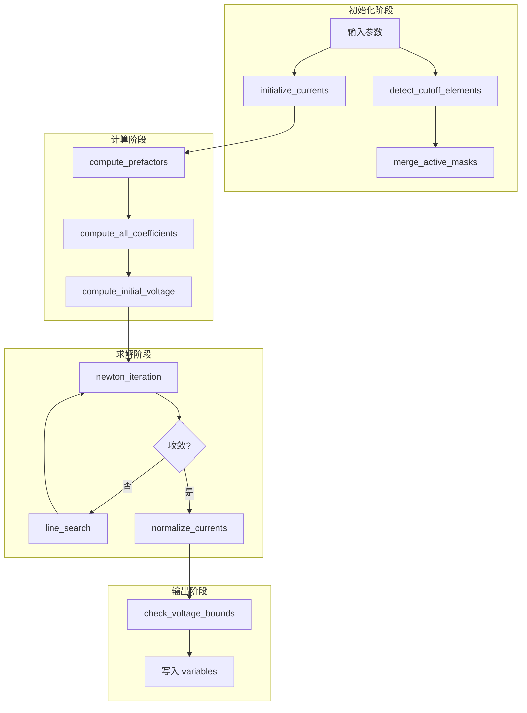

# Parallelsolution.jl 深度重构设计规格

## 概述

将 `src/Parallelsolution.jl` 从单文件结构重构为模块化结构，消除代码冗余，统一命名规范。

## 当前问题

1. **命名不一致**：非调试函数使用 `_` 前缀，与 Julia 惯例不符
2. **代码冗余**：V_branches 重复计算、归一化逻辑分散、分支判断重复
3. **文件过长**：620 行代码集中在一个文件，难以维护

## 重构目标

1. 调试函数使用 `debug_` 前缀，其余函数不使用前缀
2. 消除冗余逻辑，提取复用函数
3. 模块化拆分，保持单一职责原则
4. 保持 API 兼容，`solve_branch_currents_newton` 签名不变

## 文件结构

```
src/
├── Parallelsolution/
│   ├── types.jl           # 结构体定义
│   ├── debug.jl           # 调试工具
│   ├── electrochem.jl     # 电化学计算
│   ├── branch_model.jl    # 分支电压模型
│   ├── solver.jl          # 牛顿求解器
│   └── init.jl            # 初始化和边界检查
└── Parallelsolution.jl    # 主入口
```

## 模块职责

### types.jl

定义共用结构体：

```julia
# 分支电压系数
struct BranchCoefficients
    C1::Float64      # 开路电压项
    C2::Float64      # 温度系数
    alpha_p::Float64 # 正极过电位系数
    alpha_n::Float64 # 负极过电位系数
    C5::Float64      # 欧姆电阻
end

# 预计算因子
struct ElectrochemicalPrefactors
    prefactor_n::Float64
    prefactor_p::Float64
    csn_av::Float64
    csp_av::Float64
    u_n_ref_val::Float64
    u_p_ref_val_val::Float64
    du_n_dT_val::Float64
    du_p_dT_val::Float64
    c_sigma::Float64
end

# 求解器状态
mutable struct SolverState
    I_e::Vector{Float64}      # 单元电流
    V::Float64                # 公共电压
    active_mask::BitVector    # 活跃单元掩码
    converged::Bool           # 收敛标志
    iterations::Int           # 迭代次数
end
```

### debug.jl

调试函数（使用 `debug_` 前缀）：

```julia
"""
    debug_check_prefactors(...)

检查并报告预计算值中的 NaN/Inf（仅调试模式启用）
"""
function debug_check_prefactors(prefactors, cn_surf, cp_surf, ce_n_gs, ce_p_gs)
    # 实现...
end

"""
    debug_check_coefficients(...)

检查单元系数是否有效
"""
function debug_check_coefficients(e, coeff, T_e, j0_n, j0_p, u_n, u_p)
    # 实现...
end

"""
    debug_check_voltage(...)

检查初始电压是否有效
"""
function debug_check_voltage(V, V_branches, I_e, coeffs, I_total, ne)
    # 实现...
end
```

### electrochem.jl

电化学计算函数（无前缀）：

```julia
"""
    scalarize(x)

将数组转为标量（取第一个元素）
"""
scalarize(x) = isa(x, Number) ? Float64(x) : Float64(x[1])

"""
    compute_prefactors(variables, param, mesh_ne, mesh_pe)

计算电化学预因子
"""
function compute_prefactors(variables, param, mesh_ne, mesh_pe)
    # 实现...
end

"""
    compute_element_coefficients(e, T_e, param, prefactors, T_ref)

计算单个单元的电化学系数
"""
function compute_element_coefficients(e, T_e, param, prefactors, T_ref)
    # 实现...
end

"""
    compute_all_coefficients(ne, Te_prev, param, prefactors, T_ref)

批量计算所有单元的系数
"""
function compute_all_coefficients(ne, Te_prev, param, prefactors, T_ref)
    # 使用 map 或广播替代循环
    return map(e -> compute_element_coefficients(e, Te_prev[e], param, prefactors, T_ref), 1:ne)
end
```

### branch_model.jl

分支电压模型（无前缀）：

```julia
"""
    branch_voltage(coeff, I::Float64)

计算分支电压 V = C1 + C2*(asinh(α_p*I) - asinh(α_n*I)) - C5*I
"""
function branch_voltage(coeff, I::Float64)
    apI = coeff.alpha_p * I
    anI = coeff.alpha_n * I
    return coeff.C1 + coeff.C2 * (asinh(apI) - asinh(anI)) - coeff.C5 * I
end

"""
    branch_dVdI(coeff, I::Float64)

计算分支电压对电流的导数 dV/dI
"""
function branch_dVdI(coeff, I::Float64)
    apI = coeff.alpha_p * I
    anI = coeff.alpha_n * I
    denom_p = sqrt(1.0 + apI * apI)
    denom_n = sqrt(1.0 + anI * anI)
    return coeff.C2 * (coeff.alpha_p / denom_p - coeff.alpha_n / denom_n) - coeff.C5
end

"""
    compute_all_branch_voltages(coeffs, I_e)

计算所有单元的分支电压（消除冗余计算）
"""
function compute_all_branch_voltages(coeffs, I_e)
    return [branch_voltage(coeffs[e], I_e[e]) for e in 1:length(I_e)]
end
```

### solver.jl

牛顿求解器（无前缀）：

```julia
"""
    line_search(I_e, V, ΔI, ΔV, I_trial, ne; max_attempts=12)

线搜索确保更新后的值有效
"""
function line_search(I_e, V, ΔI, ΔV, I_trial, ne; max_attempts=12)
    # 实现...
end

"""
    newton_iteration!(state, ne, w, I_total, coeffs; tol_V=1e-8, tol_I=1e-10, max_iters=25)

牛顿迭代主循环（支持部分单元截止）
"""
function newton_iteration!(state, ne, w, I_total, coeffs; kwargs...)
    # 实现...
end
```

### init.jl

初始化和边界检查（无前缀）：

```julia
"""
    initialize_currents(ne, w, I_total, x_prev)

初始化单元电流猜测
"""
function initialize_currents(ne, w, I_total, x_prev)
    # 实现...
end

"""
    normalize_currents!(I_e, w, I_total, active_idx)

归一化电流以满足总电流约束（统一归一化逻辑）
"""
function normalize_currents!(I_e, w, I_total, active_idx)
    # 实现...
end

"""
    detect_cutoff_elements(coeffs, ne, V_MIN, V_MAX, I_total, phi_scale)

检测达到截止电压的单元
"""
function detect_cutoff_elements(coeffs, ne, V_MIN, V_MAX, I_total, phi_scale)
    # 实现...
end

"""
    check_voltage_bounds(V, V_MIN, V_MAX, phi_scale)

检查电压边界
"""
function check_voltage_bounds(V, V_MIN, V_MAX, phi_scale)
    # 实现...
end

"""
    compute_initial_voltage(coeffs, I_e, active_idx, ne)

计算初始电压（消除重复计算）
"""
function compute_initial_voltage(coeffs, I_e, active_idx, ne)
    if isempty(active_idx)
        return sum(c.C1 for c in coeffs) / ne
    else
        V_branches = [branch_voltage(coeffs[e], I_e[e]) for e in active_idx]
        return sum(V_branches) / length(active_idx)
    end
end
```

### Parallelsolution.jl（主入口）

```julia
# 包含子模块
include("Parallelsolution/types.jl")
include("Parallelsolution/debug.jl")
include("Parallelsolution/electrochem.jl")
include("Parallelsolution/branch_model.jl")
include("Parallelsolution/solver.jl")
include("Parallelsolution/init.jl")

"""
    solve_branch_currents_newton(case, variables, yt, t, I_total, areas, Te_prev, x_prev; deactivated_elements=nothing)

非线性分流求解器

使用牛顿法求解电流分配问题。
API 保持不变。
"""
function solve_branch_currents_newton(case::Case, variables, yt, t, I_total, areas, Te_prev, x_prev=nothing; deactivated_elements=nothing)
    # 1. 初始化
    # 2. 计算预因子
    # 3. 计算系数
    # 4. 检测截止单元
    # 5. 初始化电流
    # 6. 牛顿迭代
    # 7. 归一化
    # 8. 边界检查
    # 9. 写入结果
end
```

## 消除的冗余

| 冗余类型 | 原代码位置 | 处理方式 |
|---------|-----------|---------|
| V_branches 重复计算 | L521-532, L535 | 提取为 `compute_initial_voltage()` |
| 归一化逻辑分散 | `_initialize_currents`, L551-574 | 统一到 `normalize_currents!()` |
| 系数计算循环 | `_compute_all_coefficients` | 使用 `map` 替代 |
| active_mask 合并分散 | L494-502 | 提取为 `merge_active_masks()` |

## 数据流



## 兼容性保证

1. **API 不变**：`solve_branch_currents_newton` 函数签名保持不变
2. **导出不变**：`JuBat.jl` 中的 export 语句不需要修改
3. **行为不变**：数值结果与原实现完全一致

## 测试验证

1. 运行现有示例脚本确认功能正常
2. 对比重构前后的数值结果
3. 检查调试模式输出

## 文件修改清单

| 文件 | 操作 |
|------|------|
| `src/Parallelsolution/types.jl` | 新建 |
| `src/Parallelsolution/debug.jl` | 新建 |
| `src/Parallelsolution/electrochem.jl` | 新建 |
| `src/Parallelsolution/branch_model.jl` | 新建 |
| `src/Parallelsolution/solver.jl` | 新建 |
| `src/Parallelsolution/init.jl` | 新建 |
| `src/Parallelsolution.jl` | 重写（仅包含主函数和 include 语句）|
